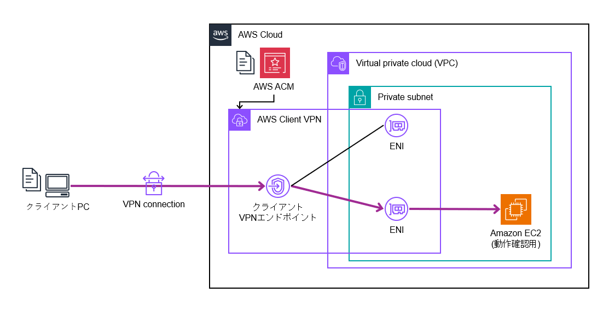
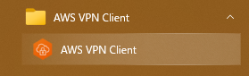
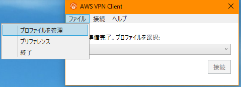
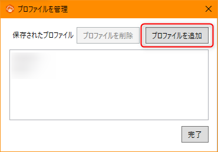
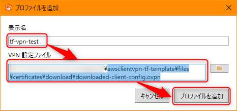
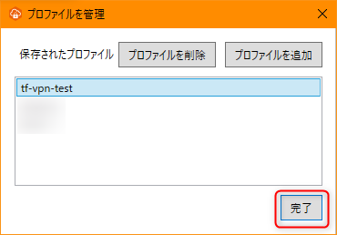
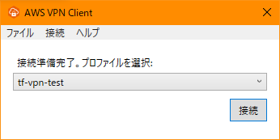
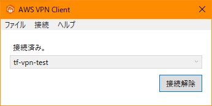

# awsclientvpn-tf-template
半分ぐらい自分用ですが、このリポジトリは既存のVPC/Subnet上にAWS Client VPNを実装するためのTerraformテンプレートになります。  
証明書の作成からACMへの登録まで自動化されています。

# 注意事項
本リポジトリでのデプロイ手順は自環境で行っています。  
極力環境依存の手順は減らすようにしてはいますが、必要に応じて読み替えてご実施ください。

# 参考手順
本テンプレートは以下の手順がベースになっています。

- [Get started with AWS Client VPN](https://docs.aws.amazon.com/ja_jp/vpn/latest/clientvpn-admin/cvpn-getting-started.html)

手動の場合は以下の流れで構築を行います。(詳細は上記ドキュメントをご確認ください)

- 1. サーバ・クライアント証明書とキー生成
- 2. クライアントVPNエンドポイント作成
- 3. ターゲットネットワークの関連付け
- 4. VPC承認ルールの追加
- 5. インターネットアクセスの提供
- 6. セキュリティグループ要件確認
- 7. クライアントVPNエンドポイント設定ファイルのダウンロード
- 8. クライアントVPNエンドポイントへの接続

上記手順の内、1,7はスクリプトで実施し、8は手動で実施します。
2～7まではTerraformで自動化します。


# 構成図
本リポジトリでは以下のようなアーキテクチャが構築されます。




# 検証環境
- 検証時の環境バージョンは以下です。
  - WSL バージョン: 2.1.5.0
  - カーネル バージョン: 5.15.146.1-2
  - Windows バージョン: 10.0.19045.4170
  - Docker version 24.0.6, build ed223bc
  - aws-vault 7.2.0-Homebrew

※記載のあるツールはインストール済みであることを前提とします


# 前提条件
- デプロイに必要な1つのVPCとPrivate Subnetは既に作成されていること。
- 動作確認用のEC2も構築する場合、EC2に関連付けるキーペアも作成されていること。
- 以下のツール群が既にインストールされていること。
  - docker([参考URL](https://zenn.dev/thyt_lab/articles/fee07c278fcaa8))
  - aws-vault([参考URL](https://qiita.com/tawara_/items/b993815a1bdc3789a3ff))
    - MFA設定している方は[MFA設定](https://qiita.com/ezaqiita/items/335faf2c122ebd90b6a4)も忘れず
- AWSのアクセスキー、シークレットアクセスキーを事前に作成され、利用可能な状態になっていること。

※Dockerとaws-vaultを使用してコンテナ上でterraformコマンドを実行するようにして、ローカルでのTerraformインストールを不要にしました。<br>


# デプロイ手順
## aws-vault設定
最初にAWSの認証情報を登録します。<br>
[プロファイル名]には自身がわかりやすいプロファイル名を設定してください。

```bash
$ aws-vault --version
$ aws-vault add [プロファイル名]

Enter Access Key ID: 
Enter Secret Access Key:
```

設定した後に.awsフォルダ配下のconfigファイルを確認すると以下のように表示されると思います。

```bash
$ cat ~/.aws/config

[default]
region=ap-northeast-1
output=json

[プロファイル名]
```

viコマンドなどを使用してconfigファイルを以下のように修正してください。<br>
mfa_serialにはご自身のものを設定してください。

```bash
$ cat ~/.aws/config

[default]
region=ap-northeast-1
output=json

[プロファイル名]
region=ap-northeast-1
output=json
mfa_serial=arn:aws:iam::123456789123:mfa/xxxxxxxx　※MFA設定している人のみ
```


## デプロイ実施
### 事前作業
リポジトリからソースコードを取得します。

```bash
$ git clone [Clone URL]
$ cd awsclientvpn-tf-template
```

デプロイコマンドを実行する前にaws-vaultを呼び出してAWSの一時的な認証情報を取得・設定します。

```bash
$ aws-vault exec [プロファイル名]

Enter MFA code for arn:aws:iam::123456789123:mfa/xxxxxxxx: 111111　※MFA設定している人のみ
Starting subshell /bin/bash, use `exit` to exit the subshell
```

エラーなく実行出来たら以下のコマンドを実行し、トークンの有効期限を確認します。

```bash
$ aws-vault list

Profile                  Credentials              Sessions
=======                  ===========              ========
default                  -                        -
[プロファイル名]          [プロファイル名]         sts.GetSessionToken:58m49s
```

`terraform/terraform.tfvars.example` ファイルをコピーして同階層に `terraform/terraform.tfvars` ファイルを作成します。  
実行環境に記載内容を編集します。動作確認用EC2を構築する場合は既存のキーペア名を指定します。

```
# ※※※ 以下は環境に合わせて変更してください ※※※

# リージョン設定
aws_region = "ap-northeast-1"

# 既存VPC ID(必須)
vpc_id = "vpc-xxxxxxxxx"

# VPNを関連付けるプライベートサブネットID(必須)
private_subnet_id = "subnet-xxxxxxxxx"

# EC2に関連付けるキーペア名(任意)
keypair_name = "sample_keypaier"

# EC2に作成するテストユーザー名(任意)
ec2_test_user = "ssh-user"
```

> [!Note]
> 動作確認用EC2を構築しない場合は `ec2.tf` をすべてコメントアウトしてください。キーペア名は変更不要です。

`01_create-certificates.sh`スクリプトを実行してローカルにサーバー証明書とクライアント証明書を生成します。  
本リポジトリでは`certificates`ディレクトリがローカルマシンとコンテナ間で共有されます。  
そのため、コンテナを終了しても証明書データは失われません。

```bash
$ docker compose run --rm --entrypoint bash terraform /files/scripts/01_create-certificates.sh
```

### デプロイ作業
Terraformコマンドを順番に実行します。<br>

```bash
$ docker compose run --rm terraform init
$ docker compose run --rm terraform plan
$ docker compose run --rm terraform apply
```

plan/applyを実行するとEC2内に作成するアクセス用ユーザーのパスワードが対話式で聞かれるので、`Password`などの適当なパスワードを設定してください。

```bash
[+] Building 0.0s (0/0)                                                                                                                                                                                                                                                                                                                                                                                      docker:default
[+] Building 0.0s (0/0)                                                                                                                                                                                                                                                                                                                                                                                      docker:default
var.ec2_test_password
  EC2に作成するテストユーザーのパスワード

  Enter a value:
```

コードが修正なければ以下のように実行していいか聞かれるので、`yes`を入力してEnterを押下します。

```bash
Do you want to perform these actions?
  Terraform will perform the actions described above.
  Only 'yes' will be accepted to approve.

  Enter a value: 
```

エラーなくapplyが成功したらAWSマネジメントコンソールからAWS Client VPNが構築されていることが確認できます。


## 接続確認
AWS Client VPNに接続するにはクライアント設定ファイルの取得と設定が必要になります。

`02_download-vpn-config.sh`スクリプトを実行して、クライアントVPNエンドポイントのクライアント設定ファイルの取得と設定を行います。  

※後続手順のVPNツールでは、この時に `./files/certificates/download` パスにダウンロードされる `downloaded-client-config.ovpn` ファイルを指定して接続を行います。

```bash
$ docker compose run --rm --entrypoint bash terraform /files/scripts/02_download-vpn-config.sh
```

VPNツール([AWS Client VPN](https://aws.amazon.com/jp/vpn/client-vpn-download/)等)を利用して構築したクライアントVPNエンドポイントに接続します。

> [!NOTE]
> AWS Client VPNを利用する場合は次の手順で接続します。
> 
> 1. AWS APN Clientを起動します。  

> 
> 2. `ファイル > プロファイルを管理`でプロファイル管理を開きます。  

> 
> 3. `プロファイルを追加`を押下します。  

> 
> 4. `表示名`と`VPN設定ファイル`を入力して、`プロファイルを追加`を押下します。  

> 
> 5. プロファイルが追加されていることを確認して`完了`を押下します。  

> 
> 6. 追加したプロファイル名を選択して`接続`を押下します。  

> 
> 7. ボタンが`接続解除`になっていればVPNへの接続は成功です。  


`03_ssh-to-ec2.sh`スクリプトを実行して、VPN経由で動作確認用EC2へのpingテストの実行を行います。  
SSH接続テストを行う場合は、スクリプトから出力されたSSHコマンドをSSHがインストールされているターミナルで実行します。

```bash
$ docker compose run --rm --entrypoint bash terraform /files/scripts/03_ssh-to-ec2.sh
```

正常にVPNに接続していてルーティングが正しければ以下のメッセージが出力されます。  
pingテストが通らない場合、VPC上のルーティングに問題がある可能性があるので、既存設定を確認してください。

```bash
VPN接続のpingテスト中...
VPN接続は正常です。EC2インスタンスに到達可能です。
```

ローカルでSSHコマンドが利用できる場合は発行された以下コマンドで動作確認用EC2へのSSH接続を行うことができます。  
異なるEC2へのSSH接続を行う場合はSecurity Groupで22番ポートとVPC CIDRのIPが許可されていることを確認してください。

```bash
以下のコマンドをコピーして別途実行してください:
-----------------------------------------------------
ssh -o StrictHostKeyChecking=no ssh-user@xx.xx.xx.xx
-----------------------------------------------------

スクリプトの実行が完了しました。上記のSSHコマンドを使用して接続してください。
パスワードはterraform apply時に指定したものを使用してください。
```

ここまでできたら接続確認は完了です。

## お片付け
終わったら以下のコマンドを実行してAWSリソースを削除します。  

```bash
$ docker compose run --rm terraform destroy
```

その他必要に応じて `./files/certificates` 配下のファイルを削除してください。